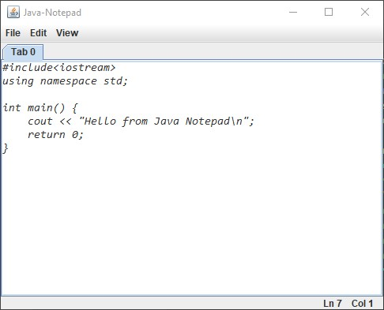

<!-- TABLE OF CONTENTS -->

  
Table of Contents

  <ol>
    <li>
      <a href="#about-the-project">About The Project</a>
      <!-- <ul>
        <li><a href="#built-with">Built With</a></li>
      </ul> -->
    </li>
    <!-- <li>
      <a href="#getting-started">Getting Started</a>
      <ul>
        <li><a href="#prerequisites">Prerequisites</a></li>
        <li><a href="#installation">Installation</a></li>
      </ul>
    </li> -->
    <li><a href="#license">License</a></li>
    <li><a href="#acknowledgements">Resources</a></li>
    <li><a href="#contributors">Contributors</a></li>
  </ol>

<!-- ABOUT THE PROJECT -->
## About The Project
Welcome to JavaNotepad. 

<!-- ## Getting Started -->

## Objectives

Features of this Text Editor:
 - Create & Open a file.
 - Read & Write to and from a file.
 - Change Font of text editor.
 - Line & Word wrapping.
 - Resizable text.

<!-- LICENSE -->
## License
 - Distributed under the MIT License. See `LICENSE` for more information.

## Resources
 - [Using Swing Components - Java Documentation](https://docs.oracle.com/javase/tutorial/uiswing/components/index.html)
## Contributors

- [Dhananjay Choudhary (@DjayChoudhary)](https://github.com/DjayChoudhary)